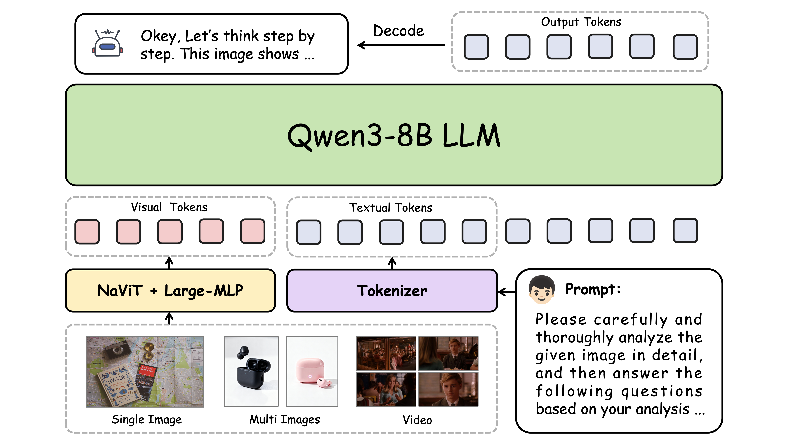
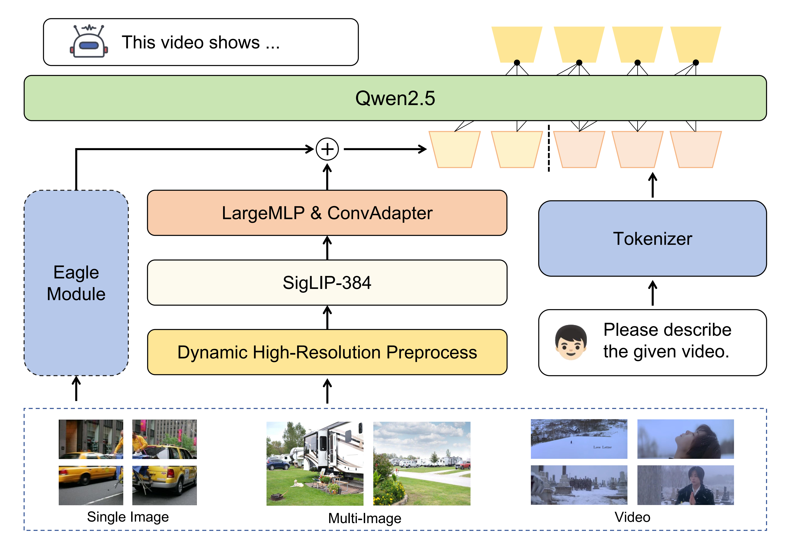
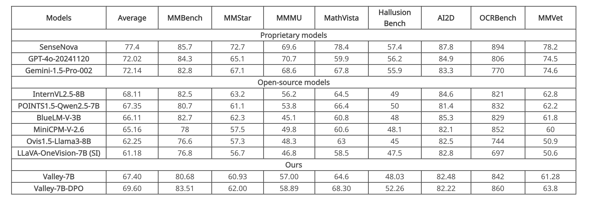

<p align="center">
    
<p>

<p align="center">
        🤗 <a href="https://huggingface.co/bytedance-research/Valley-Eagle-7B">Hugging Face</a>&nbsp&nbsp | &nbsp&nbsp🤖 <a href="https://www.modelscope.cn/models/Hyggge/Valley-Eagle-7B">ModelScope</a> &nbsp&nbsp | &nbsp&nbsp 📑 <a href="https://hyggge.github.io/projects/valley/index.html">Home Page</a> &nbsp&nbsp | &nbsp&nbsp 📙 <a href="https://arxiv.org/abs/2501.05901">Paper</a> 
</p>

## News
- [2025/10/26] 🔥🔥🔥 We have released the weights of [Valley3](https://huggingface.co/bytedance-research/Valley3), which significantly enhances multimodal understanding and reasoning capabilities. It has achieved 74.4 on the OpenCompass Multi-modal Academic Leaderboard!
- [2025/06/06] 🔥🔥 We have submitted Valley2-DPO to the closed-source OpenCompass Multi-modal Leaderboard, achieving a score of 38.62, which ranks top-3 among multi-modal models with fewer than 10 billion (10B) parameters.
- [2025/04/14] 🔥 We have released the weights of [Valley2-DPO](https://huggingface.co/bytedance-research/Valley2-DPO)!
- [2025/02/09] 🔥 We have developed the Valley2-DPO, which scored 69.6 on the Opencompass leaderboard, and the weights will be released soon.
- [2025/01/10] 🔥 Our paper has been released!  [Valley2: Exploring Multimodal Models with Scalable Vision-Language Design](https://arxiv.org/abs/2501.05901)
- [2024/12/23] 🔥 Announcing [Valley2(Valley-Eagle-7B)](https://huggingface.co/bytedance-research/Valley-Eagle-7B)!


## Introduction
Valley is a cutting-edge multimodal large model designed to handle a variety of tasks involving text, images, and video data, which is developed by ByteDance. Our model

- Achieved the best results in the inhouse e-commerce and short-video benchmarks, much better then other SOTA opensource models.
- Demonstrated comparatively outstanding performance in the OpenCompass Benchmark.

## Valley3
### Architecture
For the LLM, we select Qwen3-8B-Base, chosen for its strong reasoning and language comprehension abilities. The Vision Encoder leverages Qwen2-VL-ViT, capable of processing dynamic-resolution inputs—a more robust alternative to the commonly used tiling approach when dealing with images of extreme aspect ratios. The Projector employs a 2×2 pixelshuffle downsampling on visual tokens, followed by a two-layer MLP with a 64k hidden dimension, providing high alignment capacity between modalities.
This architectural design ensures that Valley3 achieves a balanced trade-off between representational power, computational efficiency, and multimodal adaptability.

The overall architecture is shown as follows:

<div style="display: flex;">
  
</div>

### Performance
TBD...

### Environment Setup
TBD...

### Inference Demo
TBD...

## Valley2
### Architecture
The foundational version of Valley is a multimodal large model aligned with Siglip and Qwen2.5, incorporating LargeMLP and ConvAdapter to construct the projector. 

- In the final version, we also referenced [Eagle](https://arxiv.org/pdf/2408.15998), introducing an additional VisionEncoder that can flexibly adjust the number of tokens and is parallelized with the original visual tokens. 
- This enhancement supplements the model’s performance in extreme scenarios, and we chose the Qwen2vl VisionEncoder for this purpose. 

and the model structure is shown as follows:

<div style="display:flex;">
  
</div>


### Performance

<div style="display:flex;">
  <!-- 
   -->
    
</div>
<br>

<p align="center" style="display:flex;">
    
<p>

### Environment Setup
``` bash
pip install torch==2.4.0 torchvision==0.19.0 torchaudio==2.4.0 --index-url https://download.pytorch.org/whl/cu121
pip install -r requirements.txt
```

### Inference Demo
- Single image
``` python
# Method-1
import torch
import urllib
from io import BytesIO
from PIL import Image
from transformers import AutoProcessor, AutoModel

device = torch.device("cuda" if torch.cuda.is_available() else "cpu")
model = AutoModel.from_pretrained("bytedance-research/Valley2-DPO", trust_remote_code=True)
processor = AutoProcessor.from_pretrained("bytedance-research/Valley2-DPO", trust_remote_code=True)

url = "https://images.unsplash.com/photo-1734640113825-24dd7c056052"
img = urllib.request.urlopen(url=url, timeout=5).read()
img = Image.open(BytesIO(img)).convert("RGB")
res = processor(
    {
        "conversations": 
        [
            {"role": "system", "content": "You are Valley, developed by ByteDance. Your are a helpfull Assistant."},
            {"role": "user", "content": "Describe the given image."},
        ], 
        "images": [img]
    }, 
    inference=True
)

with torch.inference_mode():
    model.to(dtype=torch.float16, device=device)
    output_ids = model.generate(
        input_ids=res["input_ids"].to(device),
        images=[[item.to(dtype=torch.float16, device=device) for item in img] for img in res["images"]],
        image_sizes=res["image_sizes"],
        pixel_values=res["pixel_values"].to(dtype=torch.float16, device=device),
        image_grid_thw=res["image_grid_thw"].to(device),
        do_sample=False,
        max_new_tokens=1024,
        repetition_penalty=1.0,
        return_dict_in_generate=True,
        output_scores=True,
    )
input_token_len = res["input_ids"].shape[1]
generation_text = processor.batch_decode(output_ids.sequences[:, input_token_len:])[0]
generation_text = generation_text.replace("<|im_end|>", "")
print(generation_text)
```

``` python
# Method-2
from valley2.valley2_chat import Valley2Chat
import urllib
from io import BytesIO
from PIL import Image

model = Valley2Chat(
    model_path="bytedance-research/Valley2-DPO",
    padding_side="left",
)

url = "https://images.unsplash.com/photo-1734640113825-24dd7c056052"
img = urllib.request.urlopen(url=url, timeout=5).read()
img = Image.open(BytesIO(img)).convert("RGB")

request = {
    "chat_history": [
        {"role": "system", "content": "You are Valley, developed by ByteDance. Your are a helpfull Assistant."},
        {"role": "user", "content": "Describe the given image."},
    ],
    "images": [img],
}
result = model(request)
print(f"\n>>> Assistant:\n")
print(result)
```

- Multi-images
``` python
# Method-1
import torch
import urllib
from io import BytesIO
from PIL import Image
from transformers import AutoProcessor, AutoModel

device = torch.device("cuda" if torch.cuda.is_available() else "cpu")
model = AutoModel.from_pretrained("bytedance-research/Valley2-DPO", trust_remote_code=True)
processor = AutoProcessor.from_pretrained("bytedance-research/Valley2-DPO",  trust_remote_code=True)

urls = [
    "https://plus.unsplash.com/premium_photo-1661632559307-902ac3f6174c",
    "https://plus.unsplash.com/premium_photo-1661632559713-a478160cd72e",
    "https://plus.unsplash.com/premium_photo-1661607772173-54f7b8263c27",
    "https://plus.unsplash.com/premium_photo-1661607115685-36b2a7276389",
    "https://plus.unsplash.com/premium_photo-1661607103369-e799ee7ef954",
    "https://plus.unsplash.com/premium_photo-1661628841460-1c9d7e6669ec",
    "https://plus.unsplash.com/premium_photo-1661602273588-f213a4155caf",
    "https://plus.unsplash.com/premium_photo-1661602247160-d42d7aba6798"
]

url2img = lambda url: Image.open(
    BytesIO(urllib.request.urlopen(url=url, timeout=5).read())
).convert("RGB")

imgs = [url2img(url) for url in urls]

res = processor(
    {
        "conversations": 
        [
            {"role": "system", "content": "You are Valley, developed by ByteDance. Your are a helpfull Assistant."},
            {"role": "user", "content": "Describe the given images."},
        ], 
        "images": imgs
    }, 
    inference=True
)

with torch.inference_mode():
    model.to(dtype=torch.float16, device=device)
    output_ids = model.generate(
        input_ids=res["input_ids"].to(device),
        images=[[item.to(dtype=torch.float16, device=device) for item in img] for img in res["images"]],
        image_sizes=res["image_sizes"],
        pixel_values=res["pixel_values"].to(dtype=torch.float16, device=device),
        image_grid_thw=res["image_grid_thw"].to(device),
        do_sample=False,
        max_new_tokens=1024,
        repetition_penalty=1.0,
        return_dict_in_generate=True,
        output_scores=True,
    )
input_token_len = res["input_ids"].shape[1]
generation_text = processor.batch_decode(output_ids.sequences[:, input_token_len:])[0]
generation_text = generation_text.replace("<|im_end|>", "")
print(generation_text)
```

``` python
# Method-2
from valley2.valley2_chat import Valley2Chat
import urllib
from io import BytesIO
from PIL import Image

model = Valley2Chat(
    model_path="bytedance-research/Valley2-DPO",
    padding_side="left",
)

urls = [
    "https://plus.unsplash.com/premium_photo-1661632559307-902ac3f6174c",
    "https://plus.unsplash.com/premium_photo-1661632559713-a478160cd72e",
    "https://plus.unsplash.com/premium_photo-1661607772173-54f7b8263c27",
    "https://plus.unsplash.com/premium_photo-1661607115685-36b2a7276389",
    "https://plus.unsplash.com/premium_photo-1661607103369-e799ee7ef954",
    "https://plus.unsplash.com/premium_photo-1661628841460-1c9d7e6669ec",
    "https://plus.unsplash.com/premium_photo-1661602273588-f213a4155caf",
    "https://plus.unsplash.com/premium_photo-1661602247160-d42d7aba6798"
]

url2img = lambda url: Image.open(
    BytesIO(urllib.request.urlopen(url=url, timeout=5).read())
).convert("RGB")

imgs = [url2img(url) for url in urls]

request = {
    "chat_history": [
        {"role": "system", "content": "You are Valley, developed by ByteDance. Your are a helpfull Assistant."},
        {"role": "user", "content": "Describe the given images."},
    ],
    "images": imgs,
}
result = model(request)
print(f"\n>>> Assistant:\n")
print(result)

```

- Video
``` python
# Method-1
import torch
import urllib
from io import BytesIO
from PIL import Image
from transformers import AutoProcessor, AutoModel

device = torch.device("cuda" if torch.cuda.is_available() else "cpu")
model = AutoModel.from_pretrained("bytedance-research/Valley2-DPO", trust_remote_code=True)
processor = AutoProcessor.from_pretrained("bytedance-research/Valley2-DPO",  trust_remote_code=True)

url = 'https://videos.pexels.com/video-files/29641276/12753127_1920_1080_25fps.mp4'
video_file = './video.mp4'
response = requests.get(url)
if response.status_code == 200:
    with open("video.mp4", "wb") as f:
        f.write(response.content)
else:
    print("download error!")
    exit(0)

video_reader = decord.VideoReader(video_file)
decord.bridge.set_bridge("torch")
video = video_reader.get_batch(
    np.linspace(0,  len(video_reader) - 1, 8).astype(np.int_)
).byte()

res = processor(
    {
        "conversations": 
        [
            {"role": "system", "content": "You are Valley, developed by ByteDance. Your are a helpfull Assistant."},
            {"role": "user", "content": "Describe the given video."},
        ], 
        "images": [transforms.ToPILImage()(image.permute(2, 0, 1)).convert("RGB") for image in video],
    }, 
    inference=True
)

with torch.inference_mode():
    model.to(dtype=torch.float16, device=device)
    output_ids = model.generate(
        input_ids=res["input_ids"].to(device),
        images=[[item.to(dtype=torch.float16, device=device) for item in img] for img in res["images"]],
        image_sizes=res["image_sizes"],
        pixel_values=res["pixel_values"].to(dtype=torch.float16, device=device),
        image_grid_thw=res["image_grid_thw"].to(device),
        do_sample=False,
        max_new_tokens=1024,
        repetition_penalty=1.0,
        return_dict_in_generate=True,
        output_scores=True,
    )
input_token_len = res["input_ids"].shape[1]
generation_text = processor.batch_decode(output_ids.sequences[:, input_token_len:])[0]
generation_text = generation_text.replace("<|im_end|>", "")
print(generation_text)
```

``` python
# Method-2
from valley2.valley2_chat import Valley2Chat
import urllib
from io import BytesIO
from PIL import Image

model = Valley2Chat(
    model_path="bytedance-research/Valley2-DPO",
    padding_side="left",
)

url = 'https://videos.pexels.com/video-files/29641276/12753127_1920_1080_25fps.mp4'
video_file = './video.mp4'
response = requests.get(url)
if response.status_code == 200:
    with open("video.mp4", "wb") as f:
        f.write(response.content)
else:
    print("download error!")
    exit(0)

video_reader = decord.VideoReader(video_file)
decord.bridge.set_bridge("torch")
video = video_reader.get_batch(
    np.linspace(0,  len(video_reader) - 1, 8).astype(np.int_)
).byte()

request = {
    "chat_history": [
        {'role': 'system', 'content': 'You are Valley, developed by ByteDance. Your are a helpfull Assistant.'},
        {'role': 'user', 'content': 'Describe the given video.'},
    ],
    "images": [transforms.ToPILImage()(image.permute(2, 0, 1)).convert("RGB") for image in video],
}
result = model(request)
print(f"\n>>> Assistant:\n")
print(result)
```

## Related Project
We list related Project
- [Valley: Video Assistant with Large Language model Enhanced abilitY](https://github.com/RupertLuo/Valley)
- [LLaVA: Large Language and Vision Assistant](https://github.com/haotian-liu/LLaVA)
- [Eagle: Exploring The Design Space for Multimodal LLMs with Mixture of Encoders](https://github.com/NVlabs/EAGLE)
- [LLaVA-CoT: Let Vision Language Models Reason Step-by-Step](https://github.com/PKU-YuanGroup/LLaVA-CoT)
- [Qwen2.5](https://github.com/QwenLM/Qwen2.5)
- [Qwen3](https://github.com/QwenLM/Qwen3)

## License Agreement
All of our open-source models are licensed under the [Apache-2.0](./LICENSE) license.

## We are Hiring 🔥🔥🔥
The Tiktop-Ecommerce Team focuses on the research and development of multi-modal large model algorithms and foundational algorithms, we welcome inquiries and look forward to working on challenging projects with talented individuals like you!

Location: Beijing / Shanghai / Hangzhou / Singapore

Contact & Resume Submission: wuheng.2024@bytedance.com

> Tiktok-电商团队专注于多模态大模型算法和基础算法的研发，欢迎咨询(实习/全职)，期待和优秀的你，一起做有挑战的事情！
>
> 岗位城市：北京/上海/杭州/新加坡 
> 
> 咨询&简历投递：wuheng.2024@bytedance.com

## Citation
```
@article{wu2025valley2,
  title={Valley2: Exploring Multimodal Models with Scalable Vision-Language Design},
  author={Wu, Ziheng and Chen, Zhenghao and Luo, Ruipu and Zhang, Can and Gao, Yuan and He, Zhentao and Wang, Xian and Lin, Haoran and Qiu, Minghui},
  journal={arXiv preprint arXiv:2501.05901},
  year={2025}
}
```
