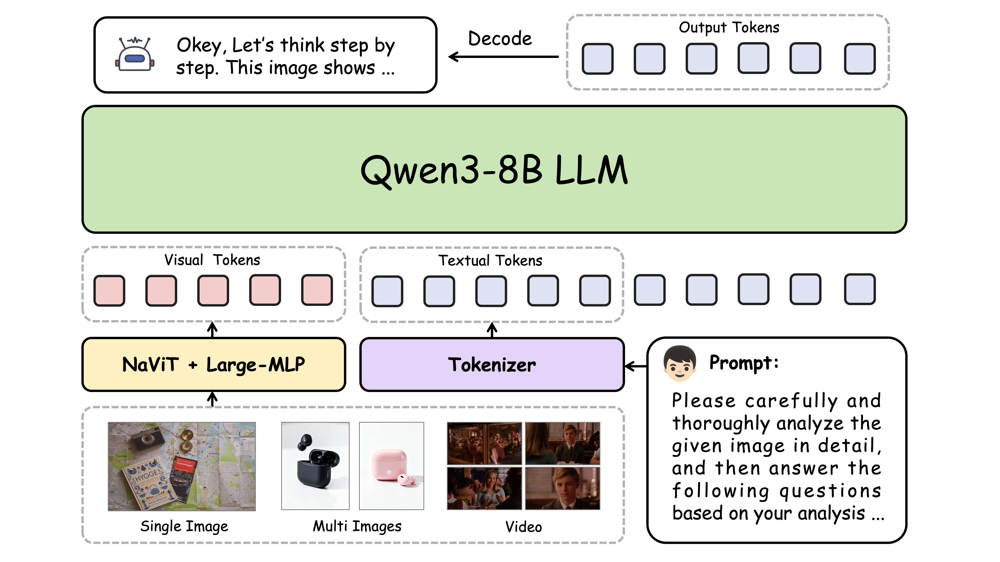
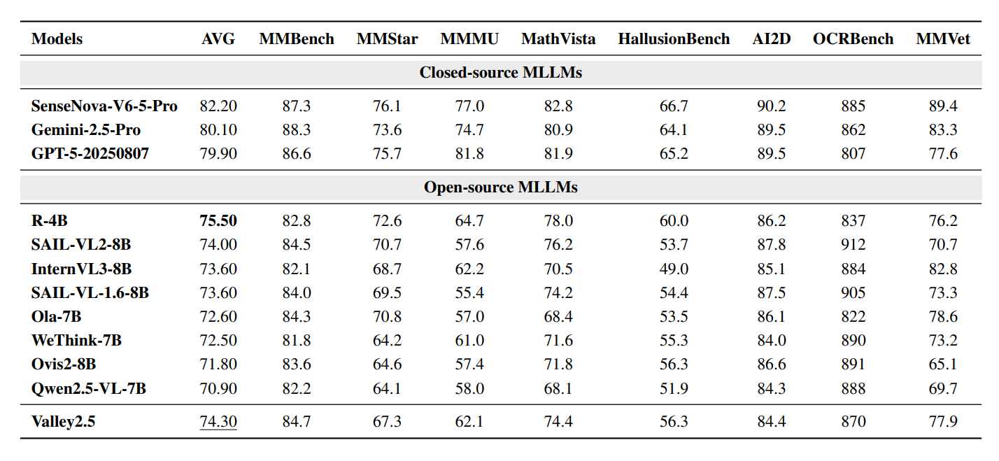

<div align="center">

# Valley Family: Exploring Scalable Vision-Language Design for Multimodal Understanding and Reasoning

</div align="center">


<p align="center">
    
<p>

<p align="center">
        &nbsp&nbsp 🤗 <a href="https://huggingface.co/bytedance-research/Valley3-8B-Instruct">Valley3 8B Instruct </a>&nbsp&nbsp |
        &nbsp&nbsp 🤗 <a href="https://huggingface.co/bytedance-research/Valley3-8B-Think">Valley3 8B Think </a>&nbsp&nbsp
</p>

<p align="center">
        &nbsp&nbsp 🤗 <a href="https://huggingface.co/bytedance-research/Valley3-32B-Instruct">Valley3 32B Instruct </a>&nbsp&nbsp |
        &nbsp&nbsp 🤗 <a href="https://huggingface.co/bytedance-research/Valley3-32B-Think">Valley3 32B Think </a>&nbsp&nbsp
</p>

<p align="center">
        &nbsp&nbsp 🤗 <a href="https://huggingface.co/bytedance-research/Valley-Eagle-7B">Valley2 Model</a>&nbsp&nbsp |
        &nbsp&nbsp 🤗 <a href="https://huggingface.co/bytedance-research/Valley2-DPO">Valley2-DPO Model</a>&nbsp&nbsp |
        &nbsp&nbsp 🤗 <a href="https://huggingface.co/bytedance-research/Valley2.5">Valley2.5 Model</a>&nbsp&nbsp
</p>
<p align="center">
        &nbsp&nbsp 📙 <a href="https://arxiv.org/abs/2605.01278">Valley3 Paper</a>&nbsp&nbsp |  
        &nbsp&nbsp 📙 <a href="https://raw.githubusercontent.com/bytedance/Valley/refs/heads/main/docs/Valley2_5_Tech_Report.pdf">Valley2.5 Paper</a> &nbsp&nbsp |
        &nbsp&nbsp 📙 <a href="https://arxiv.org/abs/2501.05901">Valley2 Paper</a>&nbsp&nbsp |  
        &nbsp&nbsp 📙 <a href="https://arxiv.org/abs/2306.07207">Valley Paper</a>&nbsp&nbsp 
</p>

## News
- [2026/5/5] 🔥🔥🔥 We have released the technical report of Valley3! Check out the full paper here: [Valley3 Technical Report](https://arxiv.org/abs/2605.01278).
- [2026/5/1] 🔥🔥🔥 We have released the model weights of [Valley3](https://huggingface.co/collections/bytedance-research/valley), which is an omni foundation model collection for unified e-commerce understanding and reasoning.
- [2025/11/27] 🔥🔥 We have released the technical report of Valley2.5! Check out the full paper here: [Valley2.5 Technical Report](https://raw.githubusercontent.com/bytedance/Valley/refs/heads/main/docs/Valley2_5_Tech_Report.pdf).  
- [2025/10/26] 🔥🔥 We have released the weights of [Valley2.5](https://huggingface.co/bytedance-research/Valley2.5), which significantly enhances multimodal understanding and reasoning capabilities. It has achieved 74.3 on the OpenCompass Multi-modal Academic Leaderboard!
- [2025/06/06] 🔥🔥 We have submitted Valley2-DPO to the closed-source OpenCompass Multi-modal Leaderboard, achieving a score of 38.62, which ranks top-3 among multi-modal models with fewer than 10 billion (10B) parameters.
- [2025/04/14] 🔥 We have released the weights of [Valley2-DPO](https://huggingface.co/bytedance-research/Valley2-DPO)!
- [2025/02/09] 🔥 We have developed the Valley2-DPO, which scored 69.6 on the Opencompass leaderboard, and the weights will be released soon.
- [2025/01/10] 🔥 Our paper has been released!  [Valley2: Exploring Multimodal Models with Scalable Vision-Language Design](https://arxiv.org/abs/2501.05901)
- [2024/12/23] 🔥 Announcing [Valley2(Valley-Eagle-7B)](https://huggingface.co/bytedance-research/Valley-Eagle-7B)!
- [2023/06/12] 🔥 [Valley: Video Assistant with Large Language model Enhanced abilitY](https://arxiv.org/abs/2306.07207) has been released!


## Introduction
Valley is a cutting-edge multimodal large model designed to handle a variety of tasks involving text, images, and video data, which is developed by ByteDance. Our model:

- Achieved the best results in the inhouse e-commerce and short-video benchmarks, much better then other SOTA opensource models.
- Demonstrated comparatively outstanding performance in the OpenCompass Benchmark.

## Valley3: Scaling Omni Foundation Models for E-commerce
### Model Architecture
Valley3 is built upon the Qwen3-VL backbone and extends it with audio transformer for audio encoding. The audio embeddings are aligned to the visual-language backbone via an MLP-based connector, then concatenated with visual and text tokens into a unified input space, enabling omni-modal understanding.


### Environment Setup
We provide two inference methods for Valley3: one based on Transformers and the other on vLLM.
- Transformers: Supports version 5.0.0dev and the official 5.0release
- vLLM: Compatible with version 0.18.0
    - Main Dependencies: Torch 2.10 and CUDA 12.8
    - Make sure to install the Transformers library that has been integrated with the Valley3 model

**Please refer to the detailed instruction in [valley3](https://github.com/bytedance/Valley/tree/main/valley3) folder.**

### Inference Demo
#### I. Transformers inference scripts
We provide two model variants: Instruct​ and Think. The Think​ version requires a specific system prompt to activate its chain-of-thought reasoning capability.

```python
THINKING_SYSTEM_PROMPT = """You are a helpful assistant.
Reasoning effort: high
Reasoning policy:
- Use the specified reasoning effort as an internal guide for how much analysis to do before answering, with the reasoning enclosed within <thinking> and </thinking>.
- The response generated after </thinking> MUST strictly follow the user's instructions and required output format.
Reasoning effort levels:
- minimal: Disable internal reasoning for this effort. Output an empty <thinking>\n</thinking> before the response.
- medium: Perform internal reasoning, using clear step-by-step thinking and verifying important constraints before responding.
- high: Perform more thorough internal reasoning, consider multiple possible interpretations, alternatives, and edge cases, and carefully validate the final answer before responding."""
```
```bash
# Valley3-Instruct
CUDA_VISIBLE_DEVICES=0 nohup python3 -u valley3_instruct_inference_examples_transformers.py > valley3_instruct_inference_examples_transformers.log 2>&1 &
# Valley3-Think
CUDA_VISIBLE_DEVICES=0 nohup python3 -u valley3_think_inference_examples_transformers.py > valley3_think_inference_examples_transformers.log 2>&1 &
```

#### II. vLLM inference scripts
##### Option1: Out-of-tree plugin
```bash
VLLM_WORKER_MULTIPROC_METHOD=spawn CUDA_VISIBLE_DEVICES=0 nohup python3 -u valley3_inference_examples_vllm_outoftree.py > valley3_inference_examples_vllm_oot.log 2>&1 &
```
##### Option2: Modify vLLM’s codebase
```bash
VLLM_WORKER_MULTIPROC_METHOD=spawn CUDA_VISIBLE_DEVICES=0 nohup python3 -u valley3_inference_examples_vllm.py > valley3_inference_examples_vllm.log 2>&1 &
```

## Valley2.5
### Architecture
For the LLM, we select Qwen3-8B-Base, chosen for its strong reasoning and language comprehension abilities. The Vision Encoder leverages Qwen2-VL-ViT, capable of processing dynamic-resolution inputs—a more robust alternative to the commonly used tiling approach when dealing with images of extreme aspect ratios. The Projector employs a 2×2 pixelshuffle downsampling on visual tokens, followed by a two-layer MLP with a 64k hidden dimension, providing high alignment capacity between modalities.
This architectural design ensures that Valley2.5 achieves a balanced trade-off between representational power, computational efficiency, and multimodal adaptability.

The overall architecture is shown as follows:

<div style="display: flex;">
  
</div>

### Performance
<p align="center" style="display:flex;">
    
<p>

### Environment Setup
``` bash
pip install torch==2.4.0 torchvision==0.19.0 torchaudio==2.4.0 --index-url https://download.pytorch.org/whl/cu121
pip install -r requirements.txt
```

### Inference Demo
- Single Image
```python
import torch
import urllib
from io import BytesIO
from PIL import Image
from transformers import AutoProcessor, AutoModel

GTHINKER_SYS_PROMPT = (
    "A conversation between User and Assistant. The user asks a question, and the Assistant solves it. "
    "The assistant first thinks about the reasoning process in the mind and then provides the user with the answer. "
    "The reasoning process and answer are enclosed within <think> </think> and <answer> </answer> tags, respectively, i.e., "
    "<think> reasoning process here </think><answer> answer here </answer>. In the reasoning process enclosed within <think> </think>,"
    " each specific visual cue is enclosed within <vcues_*>...</vcues_*>, where * indicates the index of the specific cue. "
    "Before concluding the final answer, pause for a quick consistency check: verify whether the visual cues support the reasoning "
    "and whether each step logically follows from what is seen. If correct, conclude the answer; otherwise, revise the visual cues and reasoning, then conclude."
)

device = torch.device("cuda" if torch.cuda.is_available() else "cpu")
model = AutoModel.from_pretrained(
    "bytedance-research/Valley2.5", 
    trust_remote_code=True
)
processor = AutoProcessor.from_pretrained(
    "bytedance-research/Valley2.5", 
    only_navit=True,
    max_pixels=28*28*16384,
    min_pixels=28*28*4,
    trust_remote_code=True
)

url = "https://images.unsplash.com/photo-1734640113825-24dd7c056052"
img = urllib.request.urlopen(url=url, timeout=5).read()
img = Image.open(BytesIO(img)).convert("RGB")
res = processor(
    {
        "conversations": 
        [
            {"role": "system", "content": GTHINKER_SYS_PROMPT},
            {"role": "user", "content": "Describe the given image."},
        ], 
        "images": [img]
    }, 
    enable_thinking=True
)

with torch.inference_mode():
    model.to(dtype=torch.bfloat16, device=device)
    output_ids = model.generate(
        input_ids=res["input_ids"].to(device),
        image_sizes=res["image_sizes"],
        pixel_values=res["pixel_values"].to(dtype=torch.bfloat16, device=device),
        image_grid_thw=res["image_grid_thw"].to(device),
        do_sample=False,
        max_new_tokens=4096,
        repetition_penalty=1.0,
        return_dict_in_generate=True,
        output_scores=True
    )

input_token_len = res["input_ids"].shape[1]
generation_text = processor.batch_decode(output_ids.sequences[:, input_token_len:])[0]
generation_text = generation_text.replace("<|im_end|>", "")
print(generation_text)
```


- Multi Images
```python
import torch
import urllib
from io import BytesIO
from PIL import Image
from transformers import AutoProcessor, AutoModel

GTHINKER_SYS_PROMPT = (
    "A conversation between User and Assistant. The user asks a question, and the Assistant solves it. "
    "The assistant first thinks about the reasoning process in the mind and then provides the user with the answer. "
    "The reasoning process and answer are enclosed within <think> </think> and <answer> </answer> tags, respectively, i.e., "
    "<think> reasoning process here </think><answer> answer here </answer>. In the reasoning process enclosed within <think> </think>,"
    " each specific visual cue is enclosed within <vcues_*>...</vcues_*>, where * indicates the index of the specific cue. "
    "Before concluding the final answer, pause for a quick consistency check: verify whether the visual cues support the reasoning "
    "and whether each step logically follows from what is seen. If correct, conclude the answer; otherwise, revise the visual cues and reasoning, then conclude."
)

device = torch.device("cuda" if torch.cuda.is_available() else "cpu")
model = AutoModel.from_pretrained(
    "bytedance-research/Valley2.5", 
    trust_remote_code=True
)
processor = AutoProcessor.from_pretrained(
    "bytedance-research/Valley2.5", 
    only_navit=True,
    max_pixels=28*28*256,
    min_pixels=28*28*4,
    trust_remote_code=True
)

urls = [
    "https://plus.unsplash.com/premium_photo-1661632559307-902ac3f6174c",
    "https://plus.unsplash.com/premium_photo-1661632559713-a478160cd72e",
    "https://plus.unsplash.com/premium_photo-1661607772173-54f7b8263c27",
    "https://plus.unsplash.com/premium_photo-1661607115685-36b2a7276389",
    "https://plus.unsplash.com/premium_photo-1661607103369-e799ee7ef954",
    "https://plus.unsplash.com/premium_photo-1661628841460-1c9d7e6669ec",
    "https://plus.unsplash.com/premium_photo-1661602273588-f213a4155caf",
    "https://plus.unsplash.com/premium_photo-1661602247160-d42d7aba6798"
]
url2img = lambda url: Image.open(
    BytesIO(urllib.request.urlopen(url=url, timeout=5).read())
).convert("RGB")
imgs = [url2img(url) for url in urls]

res = processor(
    {
        "conversations": 
        [
            {"role": "system", "content": GTHINKER_SYS_PROMPT},
            {"role": "user", "content": "Describe the given images."},
        ], 
        "images": imgs
    }, 
    enable_thinking=True
)

with torch.inference_mode():
    model.to(dtype=torch.bfloat16, device=device)
    output_ids = model.generate(
        input_ids=res["input_ids"].to(device),
        image_sizes=res["image_sizes"],
        pixel_values=res["pixel_values"].to(dtype=torch.bfloat16, device=device),
        image_grid_thw=res["image_grid_thw"].to(device),
        do_sample=False,
        max_new_tokens=4096,
        repetition_penalty=1.0,
        return_dict_in_generate=True,
        output_scores=True
    )

input_token_len = res["input_ids"].shape[1]
generation_text = processor.batch_decode(output_ids.sequences[:, input_token_len:])[0]
generation_text = generation_text.replace("<|im_end|>", "")
print(generation_text)
```


- Video
```python
import torch
import urllib
import decord
import requests
import numpy as np
from io import BytesIO
from PIL import Image
from torchvision import transforms
from transformers import AutoProcessor, AutoModel

GTHINKER_SYS_PROMPT = (
    "A conversation between User and Assistant. The user asks a question, and the Assistant solves it. "
    "The assistant first thinks about the reasoning process in the mind and then provides the user with the answer. "
    "The reasoning process and answer are enclosed within <think> </think> and <answer> </answer> tags, respectively, i.e., "
    "<think> reasoning process here </think><answer> answer here </answer>. In the reasoning process enclosed within <think> </think>,"
    " each specific visual cue is enclosed within <vcues_*>...</vcues_*>, where * indicates the index of the specific cue. "
    "Before concluding the final answer, pause for a quick consistency check: verify whether the visual cues support the reasoning "
    "and whether each step logically follows from what is seen. If correct, conclude the answer; otherwise, revise the visual cues and reasoning, then conclude."
)

device = torch.device("cuda" if torch.cuda.is_available() else "cpu")
model = AutoModel.from_pretrained(
    "bytedance-research/Valley2.5", 
    trust_remote_code=True
)
processor = AutoProcessor.from_pretrained(
    "bytedance-research/Valley2.5", 
    only_navit=True,
    max_pixels=28*28*256,
    min_pixels=28*28*4,
    trust_remote_code=True
)

url = 'https://videos.pexels.com/video-files/29641276/12753127_1920_1080_25fps.mp4'
video_file = './video.mp4'
response = requests.get(url)
if response.status_code == 200:
    with open("video.mp4", "wb") as f:
        f.write(response.content)
else:
    print("download error!")
    exit(0)

video_reader = decord.VideoReader(video_file)
decord.bridge.set_bridge("torch")
num_frame = 8
video = video_reader.get_batch(
    np.linspace(0,  len(video_reader) - 1, num_frame).astype(np.int_)
).byte()
imgs =  [transforms.ToPILImage()(image.permute(2, 0, 1)).convert("RGB") for image in video]

res = processor(
    {
        "conversations": 
        [
            {"role": "system", "content": GTHINKER_SYS_PROMPT},
            {"role": "user", "content": "Describe the given video."},
        ], 
        "images": imgs
    }, 
    enable_thinking=True
)

with torch.inference_mode():
    model.to(dtype=torch.bfloat16, device=device)
    output_ids = model.generate(
        input_ids=res["input_ids"].to(device),
        image_sizes=res["image_sizes"],
        pixel_values=res["pixel_values"].to(dtype=torch.bfloat16, device=device),
        image_grid_thw=res["image_grid_thw"].to(device),
        do_sample=False,
        max_new_tokens=4096,
        repetition_penalty=1.0,
        return_dict_in_generate=True,
        output_scores=True
    )

input_token_len = res["input_ids"].shape[1]
generation_text = processor.batch_decode(output_ids.sequences[:, input_token_len:])[0]
generation_text = generation_text.replace("<|im_end|>", "")
print(generation_text)
```


## Valley2
The relevant codes are stored in [valley2](https://github.com/bytedance/Valley/tree/main/valley2) folder.

## Valley
The relevant codes are stored in [valley](https://github.com/bytedance/Valley/tree/main/valley) folder.

## Related Project
We list related Project
- [Valley: Video Assistant with Large Language model Enhanced abilitY](https://github.com/RupertLuo/Valley)
- [LLaVA: Large Language and Vision Assistant](https://github.com/haotian-liu/LLaVA)
- [Eagle: Exploring The Design Space for Multimodal LLMs with Mixture of Encoders](https://github.com/NVlabs/EAGLE)
- [LLaVA-CoT: Let Vision Language Models Reason Step-by-Step](https://github.com/PKU-YuanGroup/LLaVA-CoT)
- [Qwen2.5](https://github.com/QwenLM/Qwen2.5)
- [Qwen3](https://github.com/QwenLM/Qwen3)
- [Qwen3-VL](https://github.com/QwenLM/Qwen3-VL)
- [Qwen3-Omni](https://github.com/QwenLM/Qwen3-Omni)

## License Agreement
All of our open-source models are licensed under the [Apache-2.0](./LICENSE) license.

## We are Hiring 🔥🔥🔥
The Tiktop-Ecommerce Team focuses on the research and development of multi-modal large model algorithms and foundational algorithms, we welcome inquiries and look forward to working on challenging projects with talented individuals like you!

Location: Beijing / Shanghai / Hangzhou / Singapore

Contact & Resume Submission: xiaochen.qiu@bytedance.com, yangmin.priv@bytedance.com

> Tiktok-电商团队专注于多模态大模型算法和基础算法的研发，欢迎咨询(实习/全职)，期待和优秀的你，一起做有挑战的事情！
>
> 岗位城市：北京/上海/杭州/新加坡 
> 
> 咨询&简历投递：xiaochen.qiu@bytedance.com, yangmin.priv@bytedance.com

## Citation
```
@misc{chen2026valley3scalingomnifoundation,
      title={Valley3: Scaling Omni Foundation Models for E-commerce}, 
      author={Zeyu Chen and Guanghao Zhou and Qixiang Yin and Ziwang Zhao and Huanjin Yao and Pengjiu Xia and Min Yang and Cen Chen and Minghui Qiu},
      year={2026},
      eprint={2605.01278},
      archivePrefix={arXiv},
      primaryClass={cs.AI},
      url={https://arxiv.org/abs/2605.01278}, 
}

@article{wu2025valley2,
  title={Valley2: Exploring Multimodal Models with Scalable Vision-Language Design},
  author={Wu, Ziheng and Chen, Zhenghao and Luo, Ruipu and Zhang, Can and Gao, Yuan and He, Zhentao and Wang, Xian and Lin, Haoran and Qiu, Minghui},
  journal={arXiv preprint arXiv:2501.05901},
  year={2025}
}

@article{luo2023valley,
  title={Valley: Video assistant with large language model enhanced ability},
  author={Luo, Ruipu and Zhao, Ziwang and Yang, Min and Yang, Zheming and Qiu, Minghui and Wei, Zhongyu and Wang, Yanhao and Chen, Cen},
  journal={ACM Transactions on Multimedia Computing, Communications and Applications},
  year={2023},
  publisher={ACM New York, NY}
}
```
