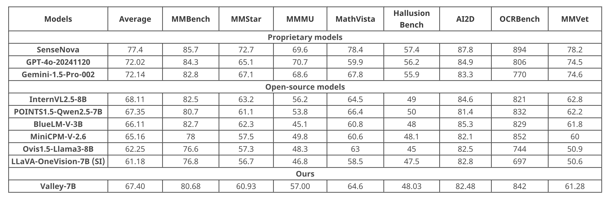

# Valley 2.0

<p align="center">
    
<p>

<p align="center">
        🤗 <a href="https://huggingface.co/bytedance-research/Valley-Eagle-7B">Hugging Face</a>&nbsp&nbsp | &nbsp&nbsp🤖 <a href="https://www.modelscope.cn/models/Hyggge/Valley-Eagle-7B">ModelScope</a> &nbsp&nbsp | &nbsp&nbsp 📑 <a href="https://hyggge.github.io/projects/valley/index.html">Home Page</a> &nbsp&nbsp | &nbsp&nbsp 📙 <a href="https://arxiv.org/abs/2501.05901">Paper</a> 
</p>


## Introduction
Valley is a cutting-edge multimodal large model designed to handle a variety of tasks involving text, images, and video data, which is developed by ByteDance. Our model

- Achieved the best results in the inhouse e-commerce and short-video benchmarks, much better then other SOTA opensource models.
- Demonstrated comparatively outstanding performance in the OpenCompass (average scores >= 67.40, *TOP2* among <10B models) tests

when evaluated against models of the same scale.

<div style="display:flex;">
  <!-- 
   -->
    
</div>
<br>

<p align="center" style="display:flex;">
    
<p>


## Valley-Eagle
The foundational version of Valley is a multimodal large model aligned with Siglip and Qwen2.5, incorporating LargeMLP and ConvAdapter to construct the projector. 

- In the final version, we also referenced [Eagle](https://arxiv.org/pdf/2408.15998), introducing an additional VisionEncoder that can flexibly adjust the number of tokens and is parallelized with the original visual tokens. 
- This enhancement supplements the model’s performance in extreme scenarios, and we chose the Qwen2vl VisionEncoder for this purpose. 

and the model structure is shown as follows:

<div style="display:flex;">
  
</div>


## Release
- [2025/01/10] 🔥 Our paper has been released!  [Valley2: Exploring Multimodal Models with Scalable Vision-Language Design](https://arxiv.org/abs/2501.05901)
- [2024/12/23] 🔥 Announcing [Valley-Eagle-7B](https://huggingface.co/bytedance-research/Valley-Eagle-7B)!

## Environment Setup
``` bash
pip install torch==2.4.0 torchvision==0.19.0 torchaudio==2.4.0 --index-url https://download.pytorch.org/whl/cu121
pip install -r requirements.txt
```

## Inference Demo
- Single image
``` python
from valley_eagle_chat import ValleyEagleChat
model = ValleyEagleChat(
    model_path='bytedance-research/Valley-Eagle-7B',
    padding_side = 'left',
)

url = 'http://p16-goveng-va.ibyteimg.com/tos-maliva-i-wtmo38ne4c-us/4870400481414052507~tplv-wtmo38ne4c-jpeg.jpeg'
img = urllib.request.urlopen(url=url, timeout=5).read()

request = {
    "chat_history": [
        {'role': 'system', 'content': 'You are Valley, developed by ByteDance. Your are a helpfull Assistant.'},
        {'role': 'user', 'content': 'Describe the given image.'},
    ],
    "images": [img],
}

result = model(request)
print(f"\n>>> Assistant:\n")
print(result)
```

- Video
``` python
from valley_eagle_chat import ValleyEagleChat
import decord
import requests
import numpy as np
from torchvision import transforms

model = ValleyEagleChat(
    model_path='bytedance-research/Valley-Eagle-7B',
    padding_side = 'left',
)

url = 'https://videos.pexels.com/video-files/29641276/12753127_1920_1080_25fps.mp4'
video_file = './video.mp4'
response = requests.get(url)
if response.status_code == 200:
    with open("video.mp4", "wb") as f:
        f.write(response.content)
else:
    print("download error!")
    exit(1)

video_reader = decord.VideoReader(video_file)
decord.bridge.set_bridge("torch")
video = video_reader.get_batch(
    np.linspace(0,  len(video_reader) - 1, 8).astype(np.int_)
).byte()
print([transforms.ToPILImage()(image.permute(2, 0, 1)).convert("RGB") for image in video])

request = {
    "chat_history": [
        {'role': 'system', 'content': 'You are Valley, developed by ByteDance. Your are a helpfull Assistant.'},
        {'role': 'user', 'content': 'Describe the given video.'},
    ],
    "images": [transforms.ToPILImage()(image.permute(2, 0, 1)).convert("RGB") for image in video],
}
result = model(request)
print(f"\n>>> Assistant:\n")
print(result)
```

## Related Project
We list related Project
- [Valley: Video Assistant with Large Language model Enhanced abilitY](https://github.com/RupertLuo/Valley)
- [LLaVA: Large Language and Vision Assistant](https://github.com/haotian-liu/LLaVA)
- [Eagle: Exploring The Design Space for Multimodal LLMs with Mixture of Encoders](https://github.com/NVlabs/EAGLE)
- [LLaVA-CoT: Let Vision Language Models Reason Step-by-Step](https://github.com/PKU-YuanGroup/LLaVA-CoT)
- [Qwen2.5](https://github.com/QwenLM/Qwen2.5)

## License Agreement
All of our open-source models are licensed under the [Apache-2.0](./LICENSE) license.

## We are Hiring 🔥🔥🔥
The Tiktop-Ecommerce Team focuses on the research and development of multi-modal large model algorithms and foundational algorithms, we welcome inquiries and look forward to working on challenging projects with talented individuals like you!

Location: Beijing / Shanghai / Hangzhou / Singapore

Contact & Resume Submission: wuheng.2024@bytedance.com

> Tiktok-电商团队专注于多模态大模型算法和基础算法的研发，欢迎咨询(实习/全职)，期待和优秀的你，一起做有挑战的事情！
>
> 岗位城市：北京/上海/杭州/新加坡 
> 
> 咨询&简历投递：wuheng.2024@bytedance.com

## Citation
Coming Soon!
