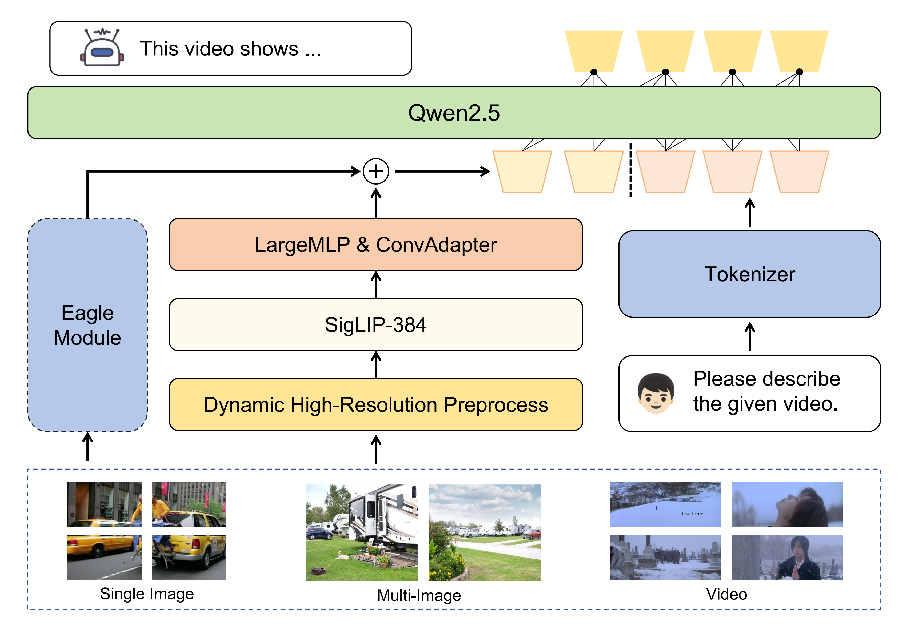
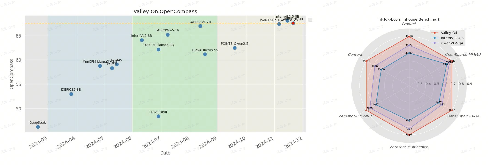
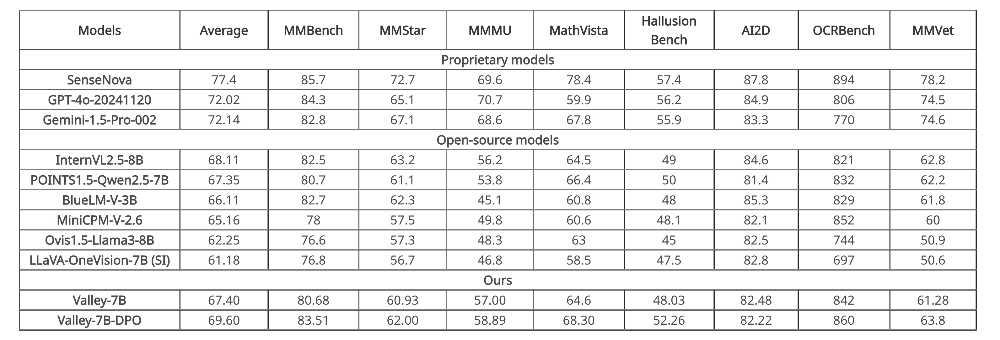

## Valley2
### Architecture
The foundational version of Valley is a multimodal large model aligned with Siglip and Qwen2.5, incorporating LargeMLP and ConvAdapter to construct the projector. 

- In the final version, we also referenced [Eagle](https://arxiv.org/pdf/2408.15998), introducing an additional VisionEncoder that can flexibly adjust the number of tokens and is parallelized with the original visual tokens. 
- This enhancement supplements the model’s performance in extreme scenarios, and we chose the Qwen2vl VisionEncoder for this purpose. 

and the model structure is shown as follows:

<div style="display:flex;">
  
</div>


### Performance

<div style="display:flex;">
  <!-- 
   -->
    
</div>
<br>

<p align="center" style="display:flex;">
    
<p>

### Environment Setup
``` bash
pip install torch==2.4.0 torchvision==0.19.0 torchaudio==2.4.0 --index-url https://download.pytorch.org/whl/cu121
pip install -r requirements.txt
```

### Inference Demo
- Single Image
``` python
# Method-1
import torch
import urllib
from io import BytesIO
from PIL import Image
from transformers import AutoProcessor, AutoModel

device = torch.device("cuda" if torch.cuda.is_available() else "cpu")
model = AutoModel.from_pretrained("bytedance-research/Valley2-DPO", trust_remote_code=True)
processor = AutoProcessor.from_pretrained("bytedance-research/Valley2-DPO", trust_remote_code=True)

url = "https://images.unsplash.com/photo-1734640113825-24dd7c056052"
img = urllib.request.urlopen(url=url, timeout=5).read()
img = Image.open(BytesIO(img)).convert("RGB")
res = processor(
    {
        "conversations": 
        [
            {"role": "system", "content": "You are Valley, developed by ByteDance. Your are a helpfull Assistant."},
            {"role": "user", "content": "Describe the given image."},
        ], 
        "images": [img]
    }, 
    inference=True
)

with torch.inference_mode():
    model.to(dtype=torch.float16, device=device)
    output_ids = model.generate(
        input_ids=res["input_ids"].to(device),
        images=[[item.to(dtype=torch.float16, device=device) for item in img] for img in res["images"]],
        image_sizes=res["image_sizes"],
        pixel_values=res["pixel_values"].to(dtype=torch.float16, device=device),
        image_grid_thw=res["image_grid_thw"].to(device),
        do_sample=False,
        max_new_tokens=1024,
        repetition_penalty=1.0,
        return_dict_in_generate=True,
        output_scores=True,
    )
input_token_len = res["input_ids"].shape[1]
generation_text = processor.batch_decode(output_ids.sequences[:, input_token_len:])[0]
generation_text = generation_text.replace("<|im_end|>", "")
print(generation_text)
```

``` python
# Method-2
from valley2.valley2_chat import Valley2Chat
import urllib
from io import BytesIO
from PIL import Image

model = Valley2Chat(
    model_path="bytedance-research/Valley2-DPO",
    padding_side="left",
)

url = "https://images.unsplash.com/photo-1734640113825-24dd7c056052"
img = urllib.request.urlopen(url=url, timeout=5).read()
img = Image.open(BytesIO(img)).convert("RGB")

request = {
    "chat_history": [
        {"role": "system", "content": "You are Valley, developed by ByteDance. Your are a helpfull Assistant."},
        {"role": "user", "content": "Describe the given image."},
    ],
    "images": [img],
}
result = model(request)
print(f"\n>>> Assistant:\n")
print(result)
```

- Multi Images
``` python
# Method-1
import torch
import urllib
from io import BytesIO
from PIL import Image
from transformers import AutoProcessor, AutoModel

device = torch.device("cuda" if torch.cuda.is_available() else "cpu")
model = AutoModel.from_pretrained("bytedance-research/Valley2-DPO", trust_remote_code=True)
processor = AutoProcessor.from_pretrained("bytedance-research/Valley2-DPO",  trust_remote_code=True)

urls = [
    "https://plus.unsplash.com/premium_photo-1661632559307-902ac3f6174c",
    "https://plus.unsplash.com/premium_photo-1661632559713-a478160cd72e",
    "https://plus.unsplash.com/premium_photo-1661607772173-54f7b8263c27",
    "https://plus.unsplash.com/premium_photo-1661607115685-36b2a7276389",
    "https://plus.unsplash.com/premium_photo-1661607103369-e799ee7ef954",
    "https://plus.unsplash.com/premium_photo-1661628841460-1c9d7e6669ec",
    "https://plus.unsplash.com/premium_photo-1661602273588-f213a4155caf",
    "https://plus.unsplash.com/premium_photo-1661602247160-d42d7aba6798"
]

url2img = lambda url: Image.open(
    BytesIO(urllib.request.urlopen(url=url, timeout=5).read())
).convert("RGB")

imgs = [url2img(url) for url in urls]

res = processor(
    {
        "conversations": 
        [
            {"role": "system", "content": "You are Valley, developed by ByteDance. Your are a helpfull Assistant."},
            {"role": "user", "content": "Describe the given images."},
        ], 
        "images": imgs
    }, 
    inference=True
)

with torch.inference_mode():
    model.to(dtype=torch.float16, device=device)
    output_ids = model.generate(
        input_ids=res["input_ids"].to(device),
        images=[[item.to(dtype=torch.float16, device=device) for item in img] for img in res["images"]],
        image_sizes=res["image_sizes"],
        pixel_values=res["pixel_values"].to(dtype=torch.float16, device=device),
        image_grid_thw=res["image_grid_thw"].to(device),
        do_sample=False,
        max_new_tokens=1024,
        repetition_penalty=1.0,
        return_dict_in_generate=True,
        output_scores=True,
    )
input_token_len = res["input_ids"].shape[1]
generation_text = processor.batch_decode(output_ids.sequences[:, input_token_len:])[0]
generation_text = generation_text.replace("<|im_end|>", "")
print(generation_text)
```

``` python
# Method-2
from valley2.valley2_chat import Valley2Chat
import urllib
from io import BytesIO
from PIL import Image

model = Valley2Chat(
    model_path="bytedance-research/Valley2-DPO",
    padding_side="left",
)

urls = [
    "https://plus.unsplash.com/premium_photo-1661632559307-902ac3f6174c",
    "https://plus.unsplash.com/premium_photo-1661632559713-a478160cd72e",
    "https://plus.unsplash.com/premium_photo-1661607772173-54f7b8263c27",
    "https://plus.unsplash.com/premium_photo-1661607115685-36b2a7276389",
    "https://plus.unsplash.com/premium_photo-1661607103369-e799ee7ef954",
    "https://plus.unsplash.com/premium_photo-1661628841460-1c9d7e6669ec",
    "https://plus.unsplash.com/premium_photo-1661602273588-f213a4155caf",
    "https://plus.unsplash.com/premium_photo-1661602247160-d42d7aba6798"
]

url2img = lambda url: Image.open(
    BytesIO(urllib.request.urlopen(url=url, timeout=5).read())
).convert("RGB")

imgs = [url2img(url) for url in urls]

request = {
    "chat_history": [
        {"role": "system", "content": "You are Valley, developed by ByteDance. Your are a helpfull Assistant."},
        {"role": "user", "content": "Describe the given images."},
    ],
    "images": imgs,
}
result = model(request)
print(f"\n>>> Assistant:\n")
print(result)

```

- Video
``` python
# Method-1
import torch
import urllib
import decord
import requests
import numpy as np
from io import BytesIO
from PIL import Image
from torchvision import transforms
from transformers import AutoProcessor, AutoModel

device = torch.device("cuda" if torch.cuda.is_available() else "cpu")
model = AutoModel.from_pretrained("bytedance-research/Valley2-DPO", trust_remote_code=True)
processor = AutoProcessor.from_pretrained("bytedance-research/Valley2-DPO",  trust_remote_code=True)

url = 'https://videos.pexels.com/video-files/29641276/12753127_1920_1080_25fps.mp4'
video_file = './video.mp4'
response = requests.get(url)
if response.status_code == 200:
    with open("video.mp4", "wb") as f:
        f.write(response.content)
else:
    print("download error!")
    exit(0)

video_reader = decord.VideoReader(video_file)
decord.bridge.set_bridge("torch")
video = video_reader.get_batch(
    np.linspace(0,  len(video_reader) - 1, 8).astype(np.int_)
).byte()

res = processor(
    {
        "conversations": 
        [
            {"role": "system", "content": "You are Valley, developed by ByteDance. Your are a helpfull Assistant."},
            {"role": "user", "content": "Describe the given video."},
        ], 
        "images": [transforms.ToPILImage()(image.permute(2, 0, 1)).convert("RGB") for image in video],
    }, 
    inference=True
)

with torch.inference_mode():
    model.to(dtype=torch.float16, device=device)
    output_ids = model.generate(
        input_ids=res["input_ids"].to(device),
        images=[[item.to(dtype=torch.float16, device=device) for item in img] for img in res["images"]],
        image_sizes=res["image_sizes"],
        pixel_values=res["pixel_values"].to(dtype=torch.float16, device=device),
        image_grid_thw=res["image_grid_thw"].to(device),
        do_sample=False,
        max_new_tokens=1024,
        repetition_penalty=1.0,
        return_dict_in_generate=True,
        output_scores=True,
    )
input_token_len = res["input_ids"].shape[1]
generation_text = processor.batch_decode(output_ids.sequences[:, input_token_len:])[0]
generation_text = generation_text.replace("<|im_end|>", "")
print(generation_text)
```

``` python
# Method-2
from valley2.valley2_chat import Valley2Chat
import urllib
import decord
import requests
import numpy as np
from io import BytesIO
from PIL import Image
from torchvision import transforms

model = Valley2Chat(
    model_path="bytedance-research/Valley2-DPO",
    padding_side="left",
)

url = 'https://videos.pexels.com/video-files/29641276/12753127_1920_1080_25fps.mp4'
video_file = './video.mp4'
response = requests.get(url)
if response.status_code == 200:
    with open("video.mp4", "wb") as f:
        f.write(response.content)
else:
    print("download error!")
    exit(0)

video_reader = decord.VideoReader(video_file)
decord.bridge.set_bridge("torch")
video = video_reader.get_batch(
    np.linspace(0,  len(video_reader) - 1, 8).astype(np.int_)
).byte()

request = {
    "chat_history": [
        {'role': 'system', 'content': 'You are Valley, developed by ByteDance. Your are a helpfull Assistant.'},
        {'role': 'user', 'content': 'Describe the given video.'},
    ],
    "images": [transforms.ToPILImage()(image.permute(2, 0, 1)).convert("RGB") for image in video],
}
result = model(request)
print(f"\n>>> Assistant:\n")
print(result)
```
