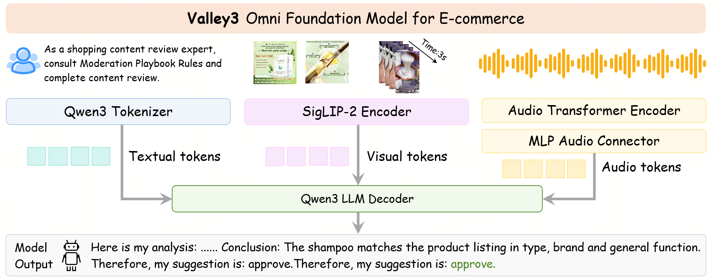

# Valley3: Scaling Omni Foundation Models for E-commerce
## Introduction
Valley3 is an efficient omni e-commerce foundation model for unified e-commerce understanding and reasoning, with three key aspects:
- Omni E-Commerce Capabilities
- Controllable Reasoning Effort
- Agentic Search Capabilities

## Model Architecture
Valley3 is built upon the Qwen3-VL backbone and extends it with audio transformer for audio encoding. The audio embeddings are aligned to the visual-language backbone via an MLP-based connector, then concatenated with visual and text tokens into a unified input space, enabling omni-modal understanding.



## Environment Setup
We provide two inference methods for Valley3: one based on Transformers and the other on vLLM.
- Transformers: Supports version 5.0.0dev and the official 5.0release
- vLLM: Compatible with version 0.18.0
    - Main Dependencies: Torch 2.10 and CUDA 12.8
    - Make sure to install the Transformers library that has been integrated with the Valley3 model

### I. Inference with Transformers 5.0
```bash
### Dependencies: torch2.8.0, torchvision0.23.0...
pip3 install torch==2.8.0 --index-url https://download.pytorch.org/whl/cu128
pip3 install torchvision==0.23.0 --no-deps
pip3 install accelerate==1.12.0
pip3 install qwen_omni_utils==0.0.8
sudo apt-get install ffmpeg
```
#### Option1: Transformers 5.0.0 dev (similar with 4.57)
```bash
wget https://github.com/huggingface/transformers/archive/8a96f5fbe814ad88e333855b2ef39c62cd961c6f.zip
unzip 8a96f5fbe814ad88e333855b2ef39c62cd961c6f.zip -d /path/to/transformers
cp -r model_valley3/transformers_5_0_0_dev /path/to/transformers/src/transformers/models/valley_omni
cd /path/to/transformers
pip3 install -e . --user
```
#### Option2: Transformers 5.0 release
```bash
git clone https://github.com/huggingface/transformers.git -b v5.0-release /path/to/transformers
cp -r model_valley3/transformers_5_0_release /path/to/transformers/src/transformers/models/valley_omni
cd /path/to/transformers
pip3 install -e . --user
```

### II. Inference with vLLM 0.18.0
vLLM 0.18.0 requires Torch 2.10 and CUDA 12.8.
#### Option1 (Recommended): Out-of-tree plugin, import Valley3 during inference
```bash
# Dependencies: torch2.10, torchvision0.25.0...
pip3 install vllm==0.18.0
# Follow the instruction in section "Inference with Transformers"
cd /path/to/transformers_5_0_release/ # or transformers_5_0_0_dev
pip3 install -e . --user
# Others
pip3 install qwen_omni_utils==0.0.8
sudo apt-get install ffmpeg
```

```python
# Refer to valley3_inference_examples_vllm_outoftree.py
from vllm import ModelRegistry
from inference_valley3.vllm_0_18_0.valley_omni_oot import ValleyOmniForConditionalGeneration
ModelRegistry.register_model("ValleyOmniForConditionalGeneration", ValleyOmniForConditionalGeneration)
```

#### Option2: Modify vLLM’s codebase, install Valley3 before inference
```bash
# Dependencies: torch2.10, ...
pip3 install vllm==0.18.0
pip3 uninstall vllm==0.18.0
git clone https://github.com/vllm-project/vllm.git -b releases/v0.18.0 /path/to/vllm
cp inference_valley3/vllm_0_18_0/registry.py /path/to/vllm/vllm/model_executor/models/
cp inference_valley3/vllm_0_18_0/valley_omni.py /path/to/vllm/vllm/model_executor/models/
# VLLM_USE_PRECOMPILED=1 is not suitable for vllm 0.18.0 so it may take a long time...
cd /path/to/vllm
pip3 install -e . --user
# Follow the instruction in section "Inference with Transformers"
cd /path/to/transformers
pip3 install -e . --user
# Others
pip3 install qwen_omni_utils==0.0.8
sudo apt-get install ffmpeg
```

## Inference Demo
### I. Transformers inference scripts
We provide two model variants: Instruct​ and Think. The Think​ version requires a specific system prompt to activate its chain-of-thought reasoning capability.

```python
THINKING_SYSTEM_PROMPT = """You are a helpful assistant.
Reasoning effort: high
Reasoning policy:
- Use the specified reasoning effort as an internal guide for how much analysis to do before answering, with the reasoning enclosed within <thinking> and </thinking>.
- The response generated after </thinking> MUST strictly follow the user's instructions and required output format.
Reasoning effort levels:
- minimal: Disable internal reasoning for this effort. Output an empty <thinking>\n</thinking> before the response.
- medium: Perform internal reasoning, using clear step-by-step thinking and verifying important constraints before responding.
- high: Perform more thorough internal reasoning, consider multiple possible interpretations, alternatives, and edge cases, and carefully validate the final answer before responding."""
```
```bash
# Valley3-Instruct
CUDA_VISIBLE_DEVICES=0 nohup python3 -u valley3_instruct_inference_examples_transformers.py > valley3_instruct_inference_examples_transformers.log 2>&1 &
# Valley3-Think
CUDA_VISIBLE_DEVICES=0 nohup python3 -u valley3_think_inference_examples_transformers.py > valley3_think_inference_examples_transformers.log 2>&1 &
```

### II. vLLM inference scripts
#### Option1: Out-of-tree plugin
```bash
VLLM_WORKER_MULTIPROC_METHOD=spawn CUDA_VISIBLE_DEVICES=0 nohup python3 -u valley3_inference_examples_vllm_outoftree.py > valley3_inference_examples_vllm_oot.log 2>&1 &
```
#### Option2: Modify vLLM’s codebase
```bash
VLLM_WORKER_MULTIPROC_METHOD=spawn CUDA_VISIBLE_DEVICES=0 nohup python3 -u valley3_inference_examples_vllm.py > valley3_inference_examples_vllm.log 2>&1 &
```
